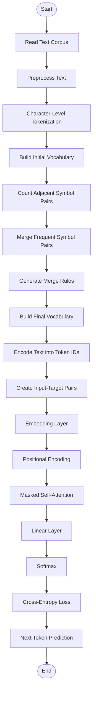

# Byte-Pair-Encoding and Mini-Autoregressive-Language-Model

🤖 End-to-End Byte Pair Encoding (BPE) and Mini Autoregressive Language Model (ARLM) using Python & NumPy

## 📖 Overview

This project implements an end-to-end Natural Language Processing (NLP) pipeline from scratch using Python and NumPy. It begins with the Byte Pair Encoding (BPE) algorithm for subword tokenization and vocabulary construction, followed by a Mini Autoregressive Language Model (ARLM) that predicts the next token using previously observed tokens.

The project demonstrates the core concepts behind modern Large Language Models (LLMs), including tokenization, embedding generation, positional encoding, masked self-attention, probability computation, and next-token prediction.

---

## 🎯 Objective

### Byte Pair Encoding (BPE)
- Read and preprocess a text corpus
- Perform character-level tokenization
- Learn merge rules through iterative pair merging
- Build a subword vocabulary
- Implement custom `encode()` and `decode()` functions

### Mini Autoregressive Language Model (ARLM)
- Create input-target token sequences
- Convert token IDs into embeddings
- Apply positional encoding
- Implement masked self-attention
- Compute token probabilities using softmax
- Calculate cross-entropy loss
- Predict the next token in a sequence

---

## ✨ Features

### Byte Pair Encoding
- Character-level tokenization
- Pair frequency calculation
- Vocabulary generation
- Merge rule learning
- Custom encode() and decode()

### Mini ARLM
- Input-target pair generation
- Embedding layer
- Positional encoding
- Causal (masked) self-attention
- Linear output layer
- Softmax probability calculation
- Cross-entropy loss computation
- Next-token prediction

---

## 🛠 Technologies Used

- Python 3
- NumPy
- Jupyter Notebook

---

## 🔄 Complete Workflow



---

## 📂 Project Structure

```text
Project/
│
├── corpus/
│   └── corpus.txt
│
├── bpe/
│   └── bpe_tokenizer.py
│
├── token_ids/
│   └── token_ids.npy
│
├── arlm/
│   └── arlm_numpy.py
│
├── outputs/
│   ├── predicted_tokens.txt
│   ├── loss.txt
│   └── sample_output.txt
│
├── README.md
└── requirements.txt
```

---

## 🎓 Learning Outcome

This project helped me understand the complete workflow of modern Large Language Models by implementing both Byte Pair Encoding (BPE) and a Mini Autoregressive Language Model (ARLM) from scratch. It provided practical knowledge of tokenization, vocabulary learning, embeddings, positional encoding, masked self-attention, probability computation, and next-token prediction.

---

## 👩‍💻 Author

**Aswini**  
B.Sc. Computer Science with Artificial Intelligence

⭐ This project was developed for educational purposes to understand the complete NLP pipeline behind modern Large Language Models using Python and NumPy.
