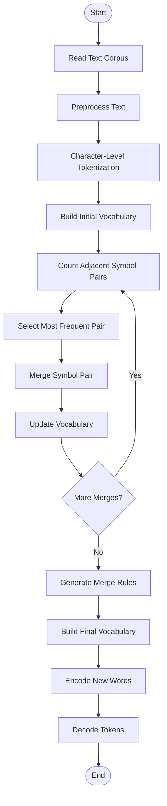

# Byte-Pair-Encoding-Implementation
📚 Custom Byte Pair Encoding (BPE) Tokenizer
📖 Overview

This project implements the Byte Pair Encoding (BPE) algorithm from scratch using Python and NumPy. BPE is a subword tokenization technique used in Large Language Models (LLMs) to build vocabularies by repeatedly merging the most frequent adjacent character pairs.

🎯 Objective
Read and preprocess a text corpus
Perform character-level tokenization
Learn merge rules through iterative pair merging
Build a subword vocabulary
Implement custom encode() and decode() functions
✨ Features
Character-level tokenization
Pair frequency calculation
Vocabulary generation
Custom encode and decode functions
Sample word testing
🛠 Technologies Used
Python 3
NumPy
Jupyter Notebook
📁 Project Structure
Custom-BPE-Tokenizer/
│── corpus.txt
│── BPE_From_Scratch.ipynb
│── README.md
## 🔄 Algorithm Workflow

                └───────────────┘
🎓 Learning Outcome

This project helped me understand the complete workflow of the Byte Pair Encoding (BPE) algorithm, including vocabulary learning, merge rule generation, and subword tokenization used in modern NLP and Large Language Models.

👩‍💻 Author

Aswini
B.Sc. Computer Science with Artificial Intelligence

⭐ This project was developed for educational purposes to understand the Byte Pair Encoding (BPE) algorithm from scratch using Python.
